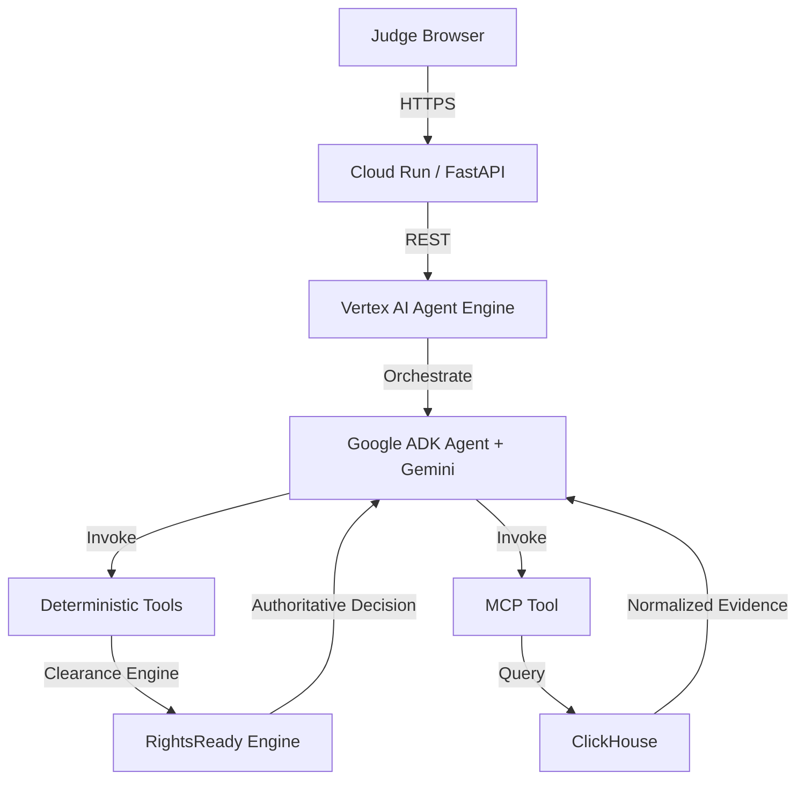

# Architecture

RightsReady implements a strict governance boundary between AI orchestration and authoritative clearance decisions.

## Architecture Diagram

## Clearance Workflow
AI is NOT the legal decision authority.
1. **Clearance Path:** Gemini orchestrates the process, calls the `deterministic_clearance` tool, which applies business rules to assets against license data, producing an **authoritative governed result**.
2. **Intelligence Path:** Gemini calls the `agent_query_warehouse` tool via MCP to retrieve live rights data from ClickHouse for contextual intelligence.
