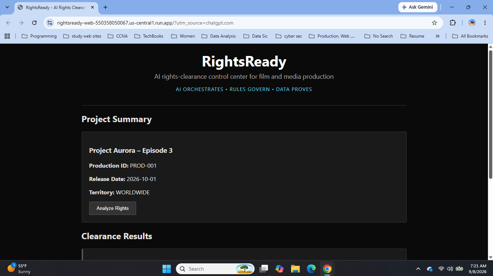
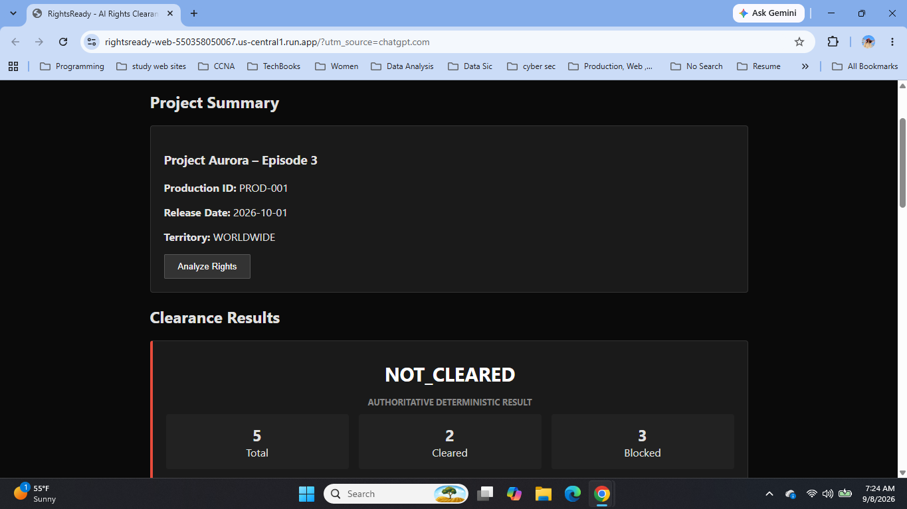
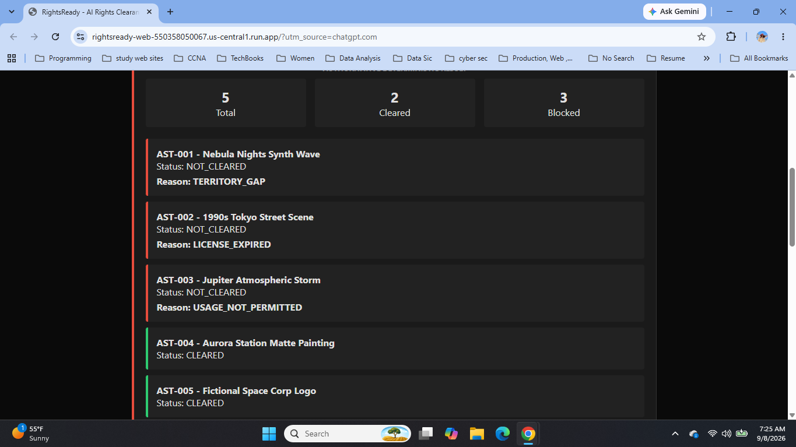
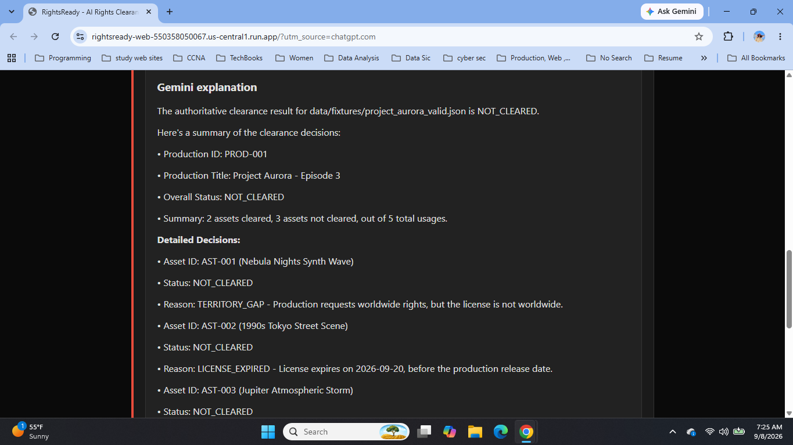
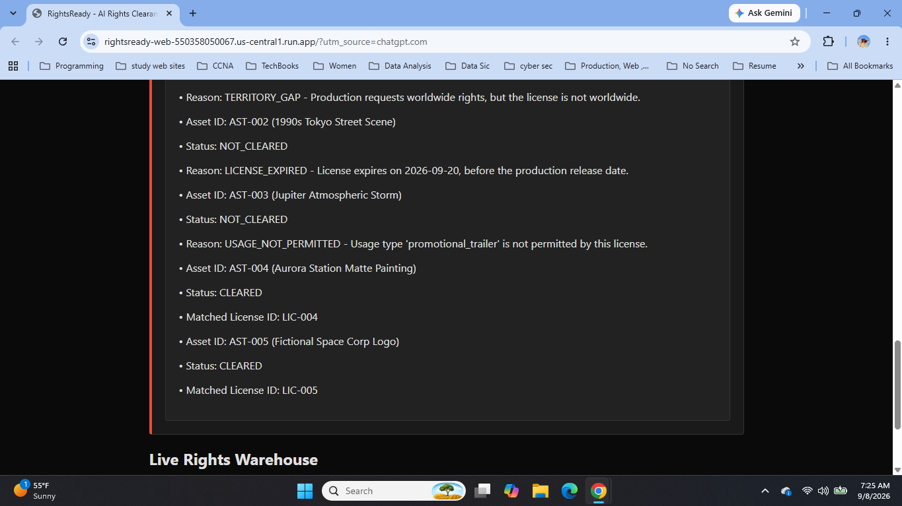
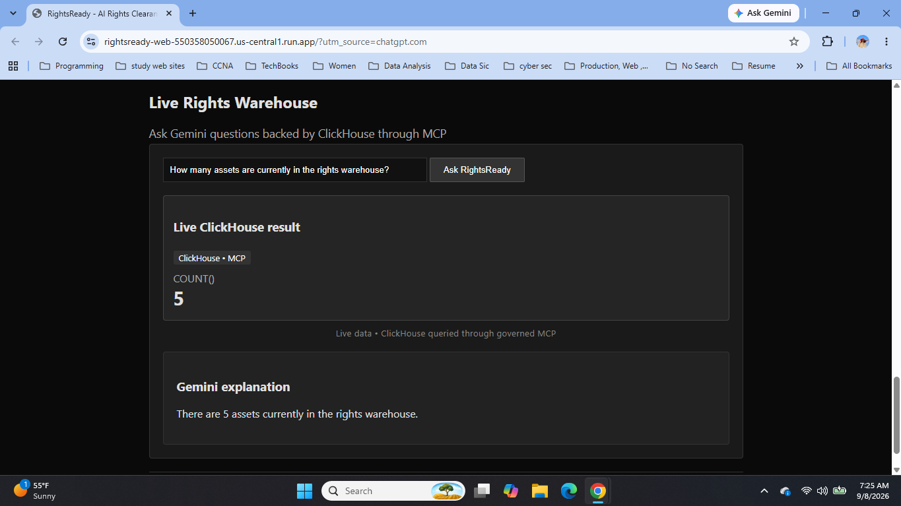

# RightsReady — Competition Evidence

**AI ORCHESTRATES • RULES GOVERN • DATA PROVES**

RightsReady is an AI rights-clearance control center for film and media production. This evidence package demonstrates the production workflow end to end: a production is analyzed, deterministic rules make the authoritative clearance decision, Gemini explains the governed result, and live warehouse intelligence is retrieved from ClickHouse through MCP.

**Production demo:** https://rightsready-web-550358050067.us-central1.run.app

---

## 1. Production Dashboard — Project Aurora

### What the judge sees
The live RightsReady interface loaded with **Project Aurora – Episode 3**, including the production ID, release date, territory, and the **Analyze Rights** action.

### What this proves
RightsReady starts from structured production context rather than an unconstrained prompt. The clearance workflow is tied to production-specific data before any rights decision is made.

### Why this matters
Rights decisions depend on context such as the production, release timing, territory, assets, licenses, and permitted usages. RightsReady makes that context explicit at the start of the workflow.

---

## 2. Authoritative Deterministic Clearance Result

### What the judge sees
The result is **NOT_CLEARED**, explicitly labeled **AUTHORITATIVE DETERMINISTIC RESULT**, with **5 total assets, 2 cleared, and 3 blocked**.

### What this proves
The authoritative clearance state is produced by deterministic clearance logic. Gemini is not asked to invent or probabilistically decide the clearance outcome.

### Why this matters
A clearance decision should be reproducible and governed. RightsReady uses AI for orchestration and explanation while keeping the authoritative clearance decision inside deterministic rules.

---

## 3. Asset-Level Governed Decisions

### What the judge sees
RightsReady evaluates each asset individually:

- **AST-001 — NOT_CLEARED — TERRITORY_GAP**
- **AST-002 — NOT_CLEARED — LICENSE_EXPIRED**
- **AST-003 — NOT_CLEARED — USAGE_NOT_PERMITTED**
- **AST-004 — CLEARED**
- **AST-005 — CLEARED**

### What this proves
Each asset usage is evaluated through deterministic rule logic and produces an explicit decision reason when blocked.

### Why this matters
Production teams do not receive only a generic pass/fail result. They can see exactly which asset is blocked and why, which makes remediation practical and reviewable.

---

## 4. Gemini Explains the Governed Result

### What the judge sees
Gemini provides a human-readable explanation of the authoritative **NOT_CLEARED** result, including the production context, the **2 cleared / 3 not cleared** summary, and the detailed decision reasons.

### What this proves
Gemini acts as the orchestration and explanation layer around governed system results.

**Gemini interprets and explains. Deterministic rules decide.**

### Why this matters
RightsReady combines conversational AI usability with a governed clearance architecture. The model helps users understand the result without becoming the clearance decision authority.

---

## 5. Traceable License-Level Explanation

### What the judge sees
The explanation continues through the individual asset outcomes and identifies matched licenses for the cleared assets, including **LIC-004** and **LIC-005**.

### What this proves
The Gemini explanation is grounded in the underlying clearance result and connects outcomes to the evidence and rule results that produced them.

### Why this matters
Reviewers can understand why an asset passed or failed and can trace the explanation back to the relevant clearance evidence rather than relying on an unsupported model answer.

---

## 6. Live ClickHouse Rights Warehouse Through MCP

### What the judge sees
A natural-language warehouse question is answered using a live ClickHouse query. The interface shows:

- the question: **How many assets are currently in the rights warehouse?**
- **ClickHouse • MCP**
- **COUNT() = 5**
- **Live data • ClickHouse queried through governed MCP**
- Gemini's human-readable explanation that there are **5 assets** in the rights warehouse

### What this proves
RightsReady can answer natural-language rights-intelligence questions using live warehouse evidence rather than model memory. MCP provides the governed tool boundary and ClickHouse provides the warehouse evidence.

### Why this matters
This demonstrates a second governed AI workflow: Gemini orchestrates the request, MCP controls tool access, ClickHouse returns the live evidence, and Gemini explains the result to the user.

---

# End-to-End Architecture

## A. Authoritative Rights-Clearance Path

`Production Context → Gemini / Agent Orchestration → Deterministic Clearance Tool → Rule Evaluation → Authoritative CLEARED / NOT_CLEARED Result → Gemini Human-Readable Explanation`

The deterministic result remains authoritative.

## B. Live Rights-Intelligence Path

`Natural-Language Question → Gemini / Agent Orchestration → Governed MCP Tool → ClickHouse Rights Warehouse → Live Query Evidence → Gemini Human-Readable Explanation`

ClickHouse remains the source of warehouse evidence.

---

# Governance Principle

| Layer | Responsibility |
|---|---|
| **AI / Gemini** | Understand intent, orchestrate tools, and explain results |
| **Deterministic rules** | Make authoritative rights-clearance decisions |
| **MCP** | Provide the governed tool boundary for warehouse access |
| **ClickHouse** | Provide live rights-intelligence evidence |
| **RightsReady UI** | Present decisions and evidence to production users |

## AI ORCHESTRATES • RULES GOVERN • DATA PROVES
